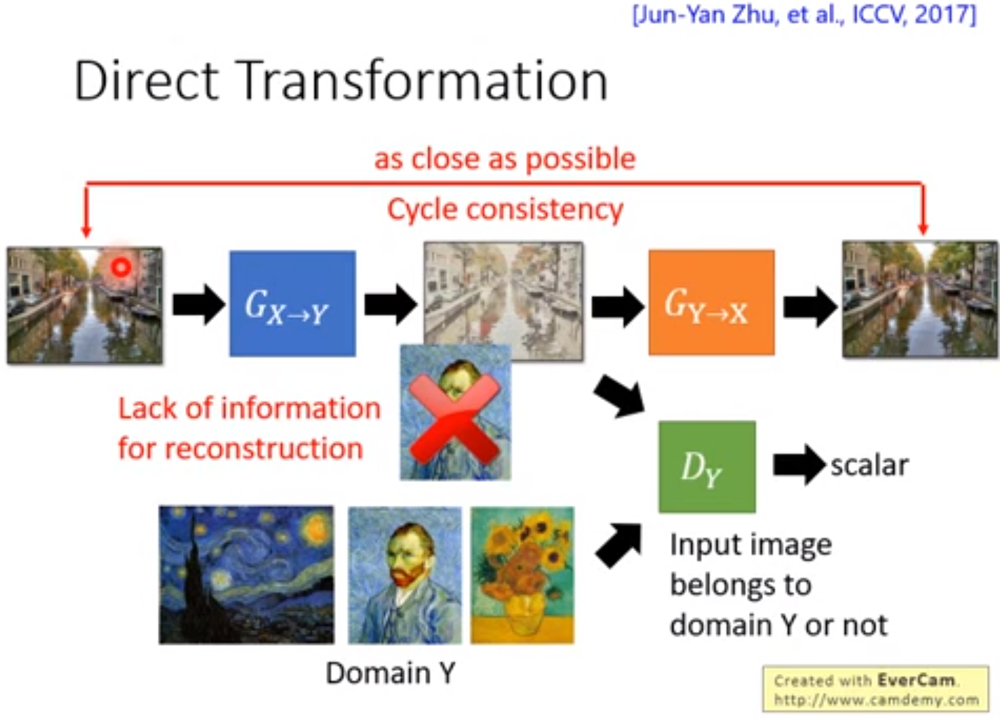
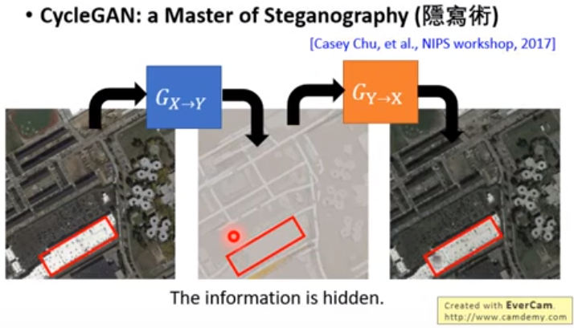
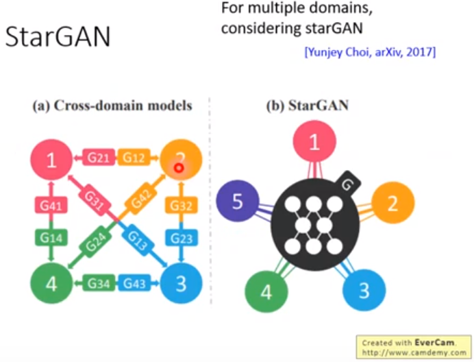
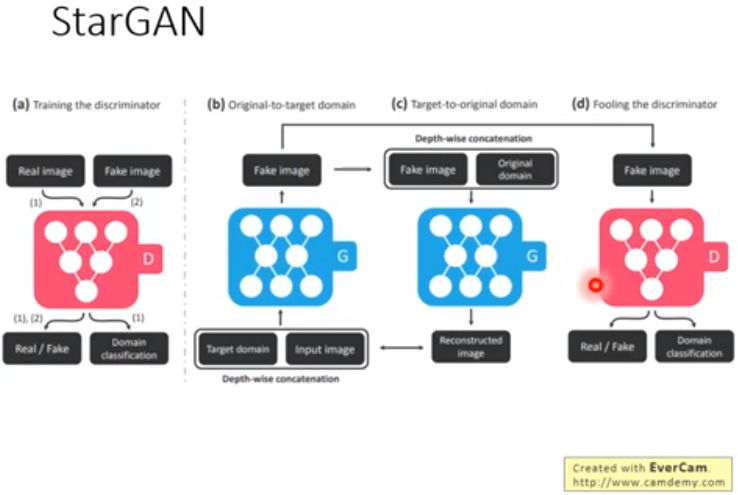
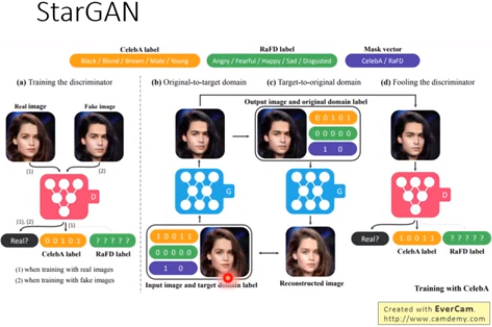
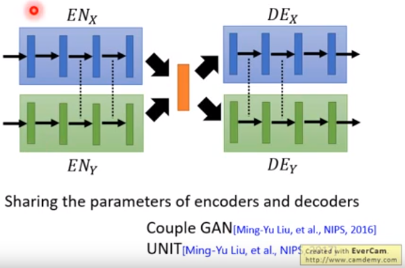
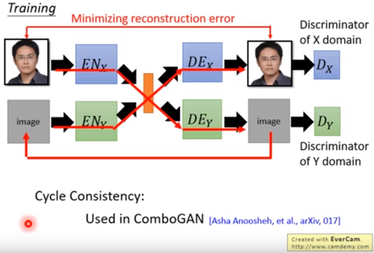

### GAN
    generator + discriminator

### genrator
    相当于encoder-decoder结构的decoder部分
    可以不需要discriminator
    可以自己学习
    但是相比于GAN，想要达到相同的效果，需要更深的网络结果，训练难度也就加大

### discriminator
    可以不需要generator
    可以生成图片
    但是生成图片的过程很困难
---
### 应用
    machine translation
        x:chinese
        y:english
    speech recognition
        x:语音
        y:文字
    chat-bot
        x:question
        y:answer
    image to image
        x:涂鸦图片
        y:真实图片
        x:黑白图片
        y:彩色图片
    text to image
        x:text
        y:image
---
### VAE
    auto-encoder(自编码器)的一种:encoder-decoder结构
    encoder部分，加入噪音训练
    增强鲁棒性

### VAE-GAN
    在VAE中加入discriminator
    可以看作是用VAE来加强GAN
    也可以看作是用GAN来加强VAE
---
### conditional GAN
    意义：输出一个要求(text, image)，输出符合要求的image
    generator输出图片
    discriminator不仅接受generator输出的图片，还要接收generator的输入(text, image...)
    起到generator要求的输入，和generator的输出相匹配

### stack GAN
    先生成小图片，再逐渐生成大图片
    64x64 -> 128x128 -> 256x256 ···

### patch GAN
    generator输出图片如果过大
    discriminator参数过多不好训练，或者过拟合
    discriminator一次不判别一整张图片
    以patch为单位来判别
    patch的大小通过调参得到
---
### unsupervise conditional GAN
    domain X -> domain Y
    discriminator能够判别图片是domain X还是domain Y
    给domain Y打高分，驱使generator从domain X产生domain Y的图
    由于没有label，generator产生的图片可能属于domain Y, 被打上高分
    但是与输入的domain X原图不匹配
    PS:输入图片，产生梵高风格的图片，但是输入的图和产生的图片内容不一样
    
### 做法0
    无约束不作处理，直接learn
    在network层数较浅的情况下
    X和generator产生的Y相差不会太大

### #做法1
    generator从X变成Y
    X和Y同时encode(VGG做feature map)形成vector embedding
    约束X和Y的vector embedding不能相差太大
    
### #做法2
    使用cycle GAN

### #cycle GAN

    
    一个generator从X变成Y，另一个generator还能够从Y变回X

### #cycle GAN存在问题

    
    两端做了限制会尽可能的像
    但是中间图可能会隐藏丢失一些信息

### #star GAN

    多域间转换
    正常情况下多域间转换需要训练多个GAN
    star GAN只需要训练一个
---
### #Couple GAN/Unit

    共享参数的两个独立的GAN:限制两个独立网络来共享某几层hidden layer的参数
    极端的情况下，可以全部共享，但设置flag来判断不同的domain

### #domain discriminator
    用来判断latent vector是来自于哪个domain
    目的是让生成latent vector能够骗过discriminator
    即discriminator无法分别vector是来自于哪个doumain
    从而让不同encoder生成的vector在相同维度上表达相同的信息

### #cycle gan

---
### voice conversion
### #过去
    A念50句话
    B念相同的50句话
    监督学习，这对数据集有很高的要求，有很大的局限性
### #GAN
    两个人的话不需要相同，语言也可以不同
    非监督学习，A一堆话，B一堆话，不需要匹配
 