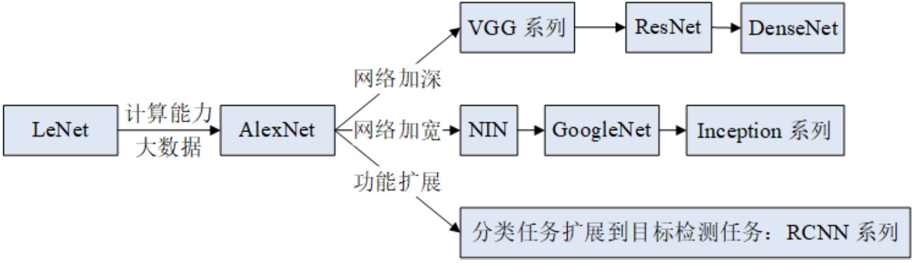

---
#### LeNet
1994 年，LeCun 提出了 LeNet ，并将其应用于银行识别和分类手写体字符。
LeNet 的诞生奠定了当代 CNNs 的基础，但由于当时计算能力和数据量的限制，CNNs 又经历了一次寒冬期。

#### AlexNet
直到 2012 年，比 LeNet 更深层的 AlexNet 模型以决定性的优势取得 ImageNet 竞赛的冠军，证明了 CNNs 应用于复杂模型的有效性，确立了 CNNs 在计算机视觉中的地位。

#### ZFNet
ZFNet 采用DeconvNet 和可视化（Visualization）技术监控学习过程；

#### VGGNet
VGGNet 采用大小为3x3 的滤波器去取代大小为 5x5 和 7x7 的滤波器从而降低计算复杂度；

#### GoogleNet
GoogleNet 推广了 NIN（Network in Network）的思路并定义 Inception 模块，采用多尺度变换和不同尺寸（1x1，3x3，5x5）的滤波器构建网络模型；

#### Highway Networks
Highway Networks 借鉴了 LSTM 的 gaiting 单元；

#### ResNet
ResNet 借鉴了 Highway Networks 的跳跃连接（Skip Connection）思想，通过训练更深层的模型提升性能，并且计算复杂度变小

#### Inception-V3 和 V4 
Inception-V3 和 V4 用 1x7 和 1x5 取代大滤波器 5x5 和 7x7，1x1 滤波器做之前的特征瓶颈，使得卷积操作变成像跨通道（Cross Channel）的相关操作；

#### DenseNet
DenseNet 主要通过跨层链接缓解了梯度消失（Vanishing Gradient）问题。
