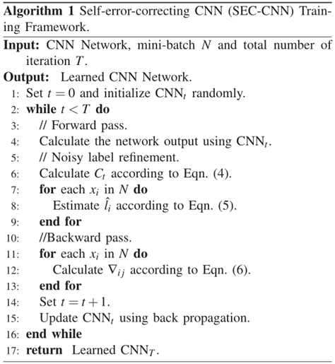
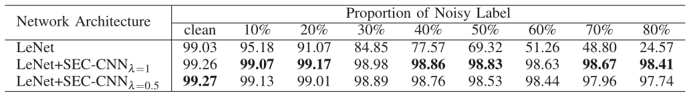
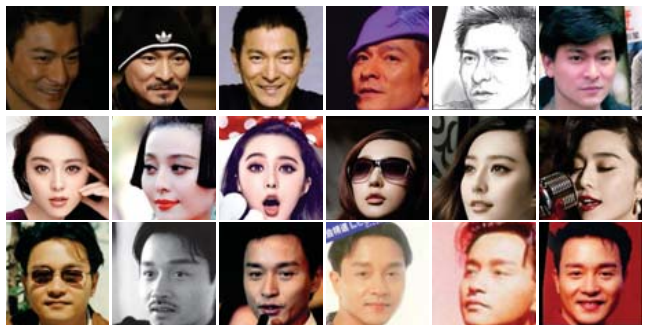

### SEC-CNN
假设模型通过训练正确的标注样本能够不断提升性能，从而提出了一种自动校正噪声标签的方法（Self-Error-CorrectingConvolutional Neural Network，SEC-CNN）。

#### 核心思想
1. 首先，设计了一种置信度策略，并将其用于决定是否修改样本类标。
2. 紧接着，通过对损失函数进行改造，使得样本的类标将以一定的概率被修改为当前模型输出层中，概率最大的神经元对应的类标。
    例如，在十分类任务中，模型的输出层 softmax 将返回分别属于十个类标的概率值。值得注意的是，概率值最大的神经元所对应的类标（记为 $\overset{\sim}y$）有可能跟样本现有的类标不一样，此时，我们可以选择使用样本原来的类标或者 $\overset{\sim}y$。我们将对 SEC-CNN 进行简要地总结，并将其应用到半监督学习方法中。

#### 主要步骤
1. 随机筛选一定数量的样本对目标模型进行预训练；
2. 使用当前模型对训练集中的所有样本进行预测并记录对应的概率值；
3. 根据公式 $C_t = C_0 \times(1 − \frac{t}{T})^\lambda$计算出本次迭代的置信值 $C_t$。其中，$C_0$ 为初始置信值、t为当前训练的迭代次数、T 为预设的训练迭代总次数、λ 用于控制 $C_t$ 对应的多项式指数；值得注意的是，随着训练迭代次数 t 的不断增加，“步骤 3”中的置信值$C_t$将不断减小，意味着样本的类标将以更大的概率修改为 $\overset{\sim}y$；
4. 结合伯努利分布（Bernoulli Distribution）进一步决定每个样本的类标：通过生成一个取值范围为 0到 1 的随机数 r，如果 $r > C_t$ 则将当前样本的类标更改为 $\overset{\sim}y$，反之不改变样本的类标；
5. 模型对更新后的标注样本进行训练，并观察模型的性能是否有所提升（作者在原文中的做法是：使用了一个自定义的 softmax 损失函数，通过反向传播过程中的梯度值反映出修改类标后的样本信息）；
6. 重复执行上述“步骤2”至“步骤5”，直到 $t>=T$ 为止。至此，完成了 SEC-CNN 的核心流程。

---
#### 实验
##### MNIST

为了模拟有噪声的标签场景，将一个训练样本的标签以一定概率随机翻转到其他9个类，也就是有噪声标签的比例。
###### 参数设置
1. LeNet
2. SGD优化
3. learning_rate = 0.01
4. batch_size = 128
5. epoch = 10000
6. 功率值为0.5的多项式策略降低了学习速度
7. 初始噪声标签置信度 $C_0 = 1.0$
8. $\lambda = 0.5 or 1.0$

不同标号噪声比例下的结果:如表所示，在不考虑噪声容忍度的情况下，两种基线网络的性能均严重下降。

相反，得益于自纠错学习框架，我们提出的方法显著提高了CNN对噪声的鲁棒性，甚至达到了80%的比例，与无噪声学习的网络相比，性能下降不到1%。

##### 工作原理分析
我们的基本假设是，即使在标签噪声较大的情况下，在训练的早期阶段，CNN也能比随机猜测学习到更好的模型。如图5所示，即使有80%的标签噪声，没有噪声标签学习的CNN在前20%的迭代中获得了合理的精度，这在实验上支持了我们的假设。这也表明，CNN网络在训练开始时就可以学习到带有噪声ground-truth标签的合理模型，这是我们方法成功的基础。同时，SEC-CNN也对损坏的标签进行了校正，在80%的标签噪声下，最终对98.13%的标签进行了校正。

##### 扩展
我们试图通过在最后一个全连接层中设置辅助噪声节点来扩展SEC-CNN来保持随机噪声。在MNIST中，我们将数据库中剩余的0到8个类随机加到9个未知类中作为随机噪声，然后湿式设置一个噪声节点来处理这种标签噪声。在MNIST上对数字0 ~ 9进行十类分类后，plain LeNet的平均准确率为88.97%，SEC-CNN的平均准确率为98.70%。该实验表明，SEC-CNN有潜力被扩展到处理被错误标记为已知类的未知类。

##### CIFAR-10

##### ImageNet

#####  Chinese Celebrity Face Dataset(CCFD)
中国名人人脸数据库(CCFD)是我们自己收集的一个大规模的真实世界的人脸数据库。该数据集包括1001个受试者，263,696张图像。CCFD中的人脸图像是在真实的网络环境中采集的，在年龄、表情、光线、遮挡和姿态等方面存在较大的差异。
1. 训练集：701个测试者的171,792个图像
2. 测试集：300个测试者的91,904张图像
3. 预处理：所有样本均提前归一化为256×256张彩色图像

与经典的图像分类设置不同，训练集和测试集在类标签中没有重叠，用这个数据集来评估带噪声标签的CNN学习特征的通用性。

---
