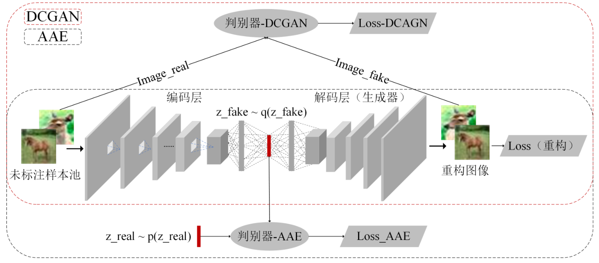

### 主动学习
#### 目的
以尽可能少的标注样本达到目标模型的预期性能，从而显著地减少样本的标注成本。

#### 做法
1. 通常，主动学习方法首先通过合适的策略主动筛选或生成最具有价值的样本，从而在一定程度上避免了人工挑选样本的偏向性和随机性。
2. 然后，专家对这些样本进行标注，并将其加入到训练数据集中。
3. 最后，模型在更新后的数据集上训练。随着训练集的规模不断增大，模型通过迭代式的训练方式不断提升性能，直到满足预设的条件为止。

#### 生成式成员查询场景
模型通过预设的条件控制生成新的样本，并向标注专家询问标签

#### 基于数据流的方法
模型按照顺序依次判断是否需要对样本进行标记
##### 优点
由于基于数据流的方法不需要将所有样本统一放在池中(批量)，
因此适用于存储空间较小以及处理能力有限的情况（如，应用到移动设备）。
##### 缺点
无法获取样本的结构分布

#### 基于未标注样本池(应用广泛)
将大量未标注样本构成未标注样本池，通过设计样本筛选策略从未标注样本池中筛选出最有
“价值”的样本优先进行标注
##### 筛选策略
1. 通过计算信息熵（entropy）、先验密度（Prior Density）、cosine距离等度量表示最不确定的样本
2. 使用 SVM 作为目标分类器，通过选择离支持向量最近的样本作为最不确定的样本
3. 基于委员会的筛选算法（Query-by-Committee，QBC），首先训练了一组分类器组成委员会。紧接着，以委员投票的方式决定筛选哪个样本作为最不确定的样本。

#### 批量式主动学习
##### 原因
1. 串行地筛选样本，即每次迭代选择一个样本进行标注，这种方式非常低效且无法满足大多数实际需求
2. 在筛选样本时，只使用了单一的不确定性指标或者多样性指标的主动选择策略，导致所挑选的样本中存在大量的冗余信息，从而造成了额外的标注成本

简单来说，每次选一个最难的样本来标注最好，但是效率太低；反之，如果每次选择最难的top-k，这top-k样本中包含的信息可能类似，容易有冗余信息。

#### 半监督主动学习方法
1. 半监督学习能够在少量标注成本的情况下训练型，通过挑选出预测结果较明确的样本并由模型直接给标签，但是容易产生噪声标签。
2. 主动学习则是挑选预测结果最不确定的样本给专家标注，能够保证标签质量。
因此，半监督学习方法和主动学习方法的结合能够在一定程度上互补优缺。

简单来说，主动学习挑选样本来给半监督学习标注。

#### 结合生成对抗网络的主动学习方法
##### 做法
主动学习策略结合生成器(generator)构建目标函数，通过解决优化问题使得生成器产生最具有“价值”的样本，提升了筛选样本的效率。

##### 例子
首先使用 GAN 沿着与当前分类器决策边界垂直的方向生成一批样本。
紧接着，通过可视化从生成的样本中找出类别发生改变的位置，并将其加入待标注样本集。

#### 主动学习框架
1. 通过随机抽样法从未标注样本池 U 中选择部分样本给相关领域的专家 S 进行标注，并将其作为模型的验证集和测试集。
2. 选择合适的模型作为分类器 G，例如基于传统机器学习算法的 SVM 或者基于深度学习方法的 AlexNet 模型。
3. 根据具体应用场景选择合适的策略 Q（例如，不确定性策略）作为筛选样本的依据，从而产生一批候选样本集 X 并交给相关领域的专家进行标注。
4. 候选样本集 X 将以增量式的方式加入标注数据集 L 中并提供给模型 G 进行训练，同时根据未被选中的样本更新未标注样本集合 U。

#### 主动学习筛选策略
1. 随机采样策略（Random Sampling ，RS ）
2. 不确定性策略（Uncertainty Strategy ，US ）：
    假设最靠近分类面的样本属于类别最模糊的样本并视为相对最有价值的样本
3. 委员会投票（Query by Committee ，QBC ）
4. 部分其他经典的策略

---
### 半监督学习
#### 作用
另一种缓解标注样本不足的方法。

#### 做法
1. 首先，通过少量目标领域的标注样本对模型进行预训练。
2. 然后，在不需要人工标注的情况下，以纯半监督学习或者直推式学习的方式训练模型。

---
#### 不同点
1. 半监督学习的优势：能够充分利用未标注样本的信息，并且不需要额外的人工标注成本。
2. 半监督学习的缺陷：在学习的过程中极有可能引入大量的噪声样本，导致模型学习到错误的信息。
#### 相同点
1. 具有相似的迭代训练过程
2. 具有部分能够互补的优缺点。
因此，主动学习方法和半监督学习方法的有效结合将有可能更加显著地减少标注成本。

---
### GAN
#### 作用
能够更好地获取图像特征，更好地解释图像语义，在无监督学习和少样本学习领域也能够挖掘出更大的作用。

#### DCGAN(深度卷积生成对抗网络)
为了提高生成图像的质量和模型的收敛速度，DCGAN 在 CNN 结构上的改造如下：
1. 分别将生成器和判别器中的池化层替换成带步长的反卷积层和卷积层；
2. 同时在生成器和判别器中引入批标准化操作（Batch Normalization）；
3. 将全连接层移除；
4. 分别将 ReLU和 Tanh 作为生成器中隐含层和输出层的激活函数；
5. 将 LeakyReLU 作为判别器中所有网络层的激活函数。

#### WGAN
WGAN 与 DCGAN 最主要的区别体现在损失函数上的改进.
其中，作者将网络参数限制在范围 ω ∈ [−0.01,0.01]内；x 表示样本；P r 表示真实样本分布，P g 表示生成器产生的样本分布；判别器网络 f ω 的最后一层移除了 DCGAN 的非线性激活层，以回归任务的方式拟合Wasserstein 距离。WGAN 缓解了 KL 散度和 JS 散度的突变性在某些情况下无法提供梯度的问题，其突破性的贡献如下：
1. 从根本上解决了 GAN 训练不稳定的问题 [95] ；
2. 解决了模式崩溃的问题，提高了生成样本的多样性；
3. 通过 Wasserstein评价指标衡量生成器的质量，为训练过程提供了指示性的依据。
WGAN 相较于DCGAN 能够提供稳定的训练过程，同时也能够在一定程度上提高生成样本的质量和多样性

#### GAAL(生成对抗主动学习)
GAAL 不需要在每次迭代中对所有未标注样本进行预测，而是直接将主动学习策略与生成器进行组合训练，直接生成待标注样本集。

#### ASAL(对抗采样主动学习方法)
1. GAAL 直接将生成的样本交由专家标注并加入训练集；
2. ASAL 采用相似度匹配算法依次对生成样本与未标注样本池中的样本进行匹配，再将未标注样本池中被匹配的样本交由专家标注后加入训练集。

### AAE-DCGAN

---
#### 随机筛选策略（Random Strategy ，RS ）：
1. 随机筛选作为一种最基础的样本筛选策略，常被用于主动学习方法中的基准对比实验（baseline）。
2. 在上述五组数据集的实验中，RS 策略在前几次迭代中的效果不亚于主动学习相关的策略。
3. 但在往后的迭代中，RS 策略对应的模型性能提升比较缓慢，甚至需要将未标注样本池都进行标注才能够达到目标准确率，相当于模型的全样本训练方式，没有减少任何标注成本。

#### 半监督学习
##### SL
SL作为半监督学习中最基础的算法之一，在每次迭代中，直接通过当前模型筛选出确定性较高的样本及其预测标签加入训练集。
1. 由于 SL 在给定样本标签的过程中可能引入大量的噪声样本，削弱甚至带偏模型。
2. 因此，SL 在第 10 次左右的迭代后，模型的性能提升非常缓慢直至停滞不前，
##### NRMSL
NRMSL 通过分别从噪声样本源和噪声样本自调整的角度对噪声样本进行处理
1. NRMSL 算法的效果明显优于 SL 算法
2. NRMSL 算法的效果接近甚至优于 RS 策略（RS 策略使用的训练集来自于专家标注的样本，而 NRMSL 不需要专家标注）。

#### 批量主动学习
##### Uncertainty-BMAL
1. 此外，虽然 Uncertainty-BMAL 在每次迭代中筛选的样本相似度较高，但被筛选的样本都是具有高度的不确定性。
2. 因此，除了 MNIST 数据集以外，Uncertainty-BMAL 的效果远远优于 RS 策略，这也是 Uncertainty 策略仍是目前较流行的原因之一。
##### CAE-C-BMAL
CAE 聚类算法将相似样本聚到同一个簇，从而增加了 CAE-C-BMAL 所筛选样本的多样性，减少了样本之间的冗余信息。
1. 因此，CAE-C-BMAL 在五组实验数据集上的效果均优于 Uncertainty-BMAL

#### NRMSL-BMAL
NRMSL-BMAL 框架巧妙地组合了 NRMSL和 CAE-C-BMAL 算法。
1. 首先，CAE-C-BAML 能够保证被筛选样本具有较高的“价值”并且标签具有较高的可靠性。
2. 其次，NRMSL 通过引入处理噪声样本的方法，从而提供了既不需要标注成本，质量又相对较高的标注样本。
    
NRMSL-BMAL在五组数据集上的效果都优于CAE-C-BAML，从而验证了 NRMSL-BMAL 框架的有效性。
其中，在 Tmall 数据集对应的实验中，NRMSL-BMAL 不仅能够显著地减少标注成本，而且最终得到的模型准确率还明显优于目标准确率。

---
