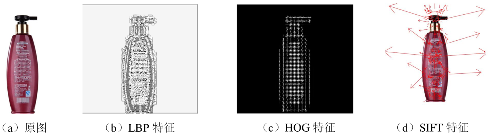

#### 局部二值模式（Local Binary Pattern ，LBP ）
Ojala 等于 1994 年提出了 LBP 特征，并将其用于提取局部纹理特征。
##### 核心思想
1. 定义于一个像素大小为 3x3 的领域中，将中心位置（2，2）的像素值设置为阈值；
2. 领域内的其余 8个位置的值取决于各自的像素值，若像素值大于阈值则为 1，否则为 0；
3. 最终将得到一个 8 位数的二进制值（代表中心位置的 LBP 值），并且能够反映该像素周围的纹理信息。
##### 改进
Ojala 等尝试将 3×3邻域扩展到任意邻域，使其能够适应不同尺度的纹理特征，具有灰度和旋转不变性的特点。
##### 应用
1. 纹理分类
2. 人脸识别
3. 目标检测等领域

----

#### 方向梯度直方图（Histogram of Oriented Gradient ，HOG ）：
Dalal等认为梯度或边缘的方向密度分布能够较好的表达局部目标的表象和形状，提出了 HOG 特征并将其应用在静态图像行人检测任务中。
HOG 特征对图像几何的形变以及光学的形变都具有良好的不变性，常与 SVM 分类器结合并应用在图像的行人检测任务中。

---

#### 尺度不变特征变换（Scale-Invariant Feature Transform ，SIFT ）
Lowe 等于 1999 年提出了 SIFT 特征，并于 2004 年进一步完善。SIFT 特征被广泛应用于关键点检测，具有旋转、尺度、平移、视角和亮度不变性等特点。
##### 核心步骤
1. 检测尺度空间中的极值；
2. 定位特征点；
3. 赋值特征方向；
4. 描述特征点。

---

