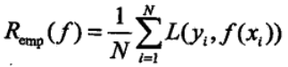
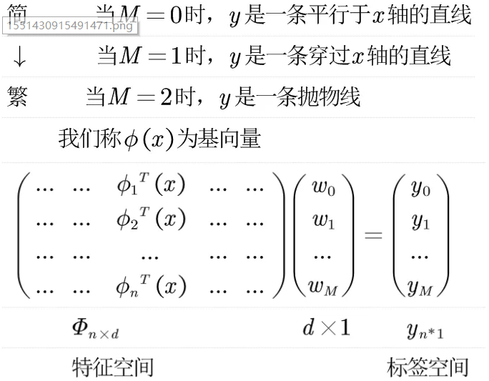

### 第一讲 机器学习基础

#### 机器学习
简单来说，是一种通过利用数据，训练出模型，然后使用模型预测的方法。

#### 学习资源
##### 书籍
* 统计机器学习  清华大学出版社
* 机器学习实战  人民邮电出版社
* Machine Learning-A Probabilistic  Perspective
* Deep Learning(俗称花书)     
##### 国际会议和期刊
* ICML,NIPS,COLT,CVPR,ICCV,ECCV
* JMLR,ML,AI,PAMI,PR,CVIU,TIP
##### 在线课程
* Andrew Ng, machine learning

##### 快速入门
* 公众号AmoyAI、机器之心，机器学习、Python学习
* 看视频，Andrew Ng的在线视频、慕课网讲授机器学习开发的课程
* 看书，李航《统计机器学习》、周志华的《机器学习》
* 编程实践，参考《机器学习实战》和github机器学习项目

#### 机器学习基础
不断产生大量的高维特征的丰富数据，通过设计算法来训练数据产生初步的模型，然后通过损失函数不断更新模型参数，持续优化得到拟合良好的模型，在测试数据过后运用到实际问题，这个过程简称LAMBDA。
##### 三要素：模型、策略、算法

##### 基本概念
* 输入空间：输入的所有可能取值
* 输出空间：输出的所有可能取值
* 特征空间：特征向量的所有可能取值
* 假设空间：输入到输出的映射集，简单来说就是模型
##### 解决过拟合的途径
* 增大数据集
* 正则化
* 平均(贝叶斯)
##### 生成式：对p(X,Y)进行建模
* 朴素贝叶斯
* 隐马尔科夫模型
##### 判别式：直接学习p(Y|X)
* k近邻，感知机、决策树、
* 逻辑斯蒂分类器、SVM、
* Boosting，CRF
##### 优化问题
###### 有解析解
* 最小二乘法

* 岭回归

###### 无解析解
* 梯度下降法/随机梯度下降法
* 牛顿法/坐标下降法
* SMO
###### 带有隐变量的求解方法
* EM求解GMM/HMM

#### 损失函数
* 损失函数(代价函数)：度量模型一次预测的好坏。
度量预测值$f(X)$和真实值$Y$之间错误程度的非负实值函数，记作$L(Y,f(x))$。

* 期望风险(期望损失)，也称泛化误差：度量平均意义下模型预测的好坏，模型关于联合分布的期望损失。
由于模型的输入、输出$(X,Y)$是随机变量，遵循联合分布$P(X,Y)$，所以损失函数的期望为

* 经验风险(经验损失)：模型关于样本的平均损失。

#### 经验风险最小化
当模型是条件概率分布，损失函数是对数损失函数时，经验风险最小化等价于极大似然估计。

#### 结构风险最小化
结构风险 = 经验风险 + 正则化项（惩罚项）

正则化项是模型复杂度的单调函数

正则化的目的是选择风险小，复杂度低的模型

#### 泛化
* 欠拟合：高偏差(均值差别很大)，低方差
* 过拟合：低偏差(均值差别不大)，高方差
bias(偏差)：bias反映的是模型在样本上的输出与真实值之间的误差，也就是模型在训练集上拟合的好不好，模型简单可能导致其与真实值出现了偏差，欠拟合。
variance(方差)：variance反映的是模型每一次输出结果与模型输出期望之间的误差，即模型的稳定性。虽然复杂模型在训练集上拟合的很好，但在测试集上的表现可能就不行了，不具有普适性，稳定性较差，过拟合。
##### 泛化的上界

#### 性能评估
https://www.jianshu.com/p/c61ae11cc5f6
* TP：将正类预测成正类数
* FP：将负类预测成正类数
* FN：将正类预测成负类数
* TN：将负类预测成负类数
##### precision：行
##### recall：列

##### ROC曲线
横轴: False Positive Rate，错误肯定，误报
纵轴:True  Positive Rate，正确肯定
AUC：曲线下面积
 

#### 例子：曲线拟合

上图共有10个点，我们可以使用下面的集合来表示：

首先我们用解析法来计算损失函数的最优权重，这个损失函数的值越小，表明预测值越接近真实值，根据数理统计中的大数定律，当我们采集到的数据趋于无穷时，模型关于联合分布的平均意义下的损失（即经验风险）趋于期望风险，而期望风险是模型关于训练集的平均损失。

由于任何一个函数都可以表示成多项式的形式，我们对每个点分别设置权重w，即可展开成下列多项式:

接下来我们采用最小二乘法来求预测值和真实值之间的损失，用均方损失函数来求解，并用矩阵来表示:

接着我们来求损失最小，使得预测最优的权重w

#### 几何法证明最小二乘法
结论：最小二乘法的几何意义是高维空间中的一个向量在低维子空间的投影

https://mp.weixin.qq.com/s?__biz=MzU1MjcxMjA0Ng==&mid=2247483685&idx=1&sn=20ef1505d37c3986fa261713b8b047f4&scene=21#wechat_redirect

#### 岭回归
当X不是列满秩时，或者某些列之间的线性相关性比较大时，$X^TX$的行列式接近于0，即$X^TX$接近于奇异，上述问题变为一个不适定问题，此时，计算时误差$(X^TX)^{-1}$会很大，传统的最小二乘法缺乏稳定性与可靠性。
为了解决上述问题，我们需要将不适定问题转化为适定问题：我们为上述损失函数加上一个正则化项，变为

##### 推导过程

根据上式，对w进行求偏导，可得

令上式为0，即

得

#### 附录

